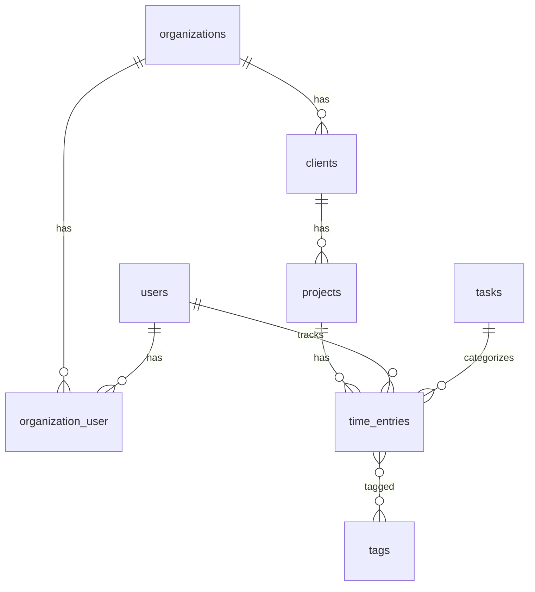

# PRD: kachink
**Version:** 2.0.0
**Datum:** 2026-09-09
**Sprache:** Englisch (UI zweisprachig EN/DE, Code und DB-Felder Englisch)
**Status:** In Umsetzung

Ziel dieser Version: kachink ersetzt das Harvest-Abo (ca. 200 USD/Monat) fuer freise design+digital. Kein Invoicing, keine Asana-Sync. Nur exzellentes Zeittracking (Web + Mac-Menubar mit Idle-Watchdog) und Berichte pro Kunde, Projekt und Teammitglied mit PDF-Export.

---

## 0. Abgleich mit dem alten PRD (prd.md v1.0, 2026-03-01)

### 0.1 Strukturelle Unterschiede zur PRD-Vorlage (Skill prd-webapp)

| Vorlage verlangt | prd.md v1.0 | Status in v2 |
|---|---|---|
| Kopf mit Version/Datum/Sprache/Status | Version/Datum/Status vorhanden, Sprache fehlt | ergaenzt |
| §3 Projektstruktur & Ordner | fehlt (nur Architekturdiagramm) | ergaenzt |
| §4 Git-Workflow (main/stage/develop, Commit-Konvention) | fehlt | ergaenzt, angepasst an Ist-Zustand (Deploy von `main`) |
| §5 Umgebungen & .env (local/stage/prod) | fehlt | ergaenzt |
| §6 Auth & Berechtigungen | nur Stichworte (§8 Security) | ergaenzt |
| §7 User Stories als Tabelle + Use Cases | Prosa-Features (§5) | als Tabelle neu gefasst |
| §8 Datenmodell als Laravel-Migrations | ASCII-Schema, ohne Organisationen | aktualisiert (Organisationen, Indizes) |
| §9 API-Endpunkte mit Auth-Spalte | Endpunkt-Liste ohne Auth | aktualisiert |
| §10 UI/UX Seitenstruktur + Wireframe-Beschreibungen | nur Prinzipien | ergaenzt |
| §11 Frontend-Architektur | Stichworte | ergaenzt |
| §12 CSS-Architektur (BEM, base_resources) | "Semantic CSS approach", real: Tailwind 4 | Migration auf SCSS/BEM in `resources/scss` (siehe §12) |
| §13 Native App Kapselung | nicht relevant | entfaellt (dokumentiert) |
| §14 Swift Helfer-Apps (Repo-Entscheidung) | Menubar beschrieben, Repo-Frage offen | selbes Repo `menubar/`, begruendet |
| §15 Deployment manuell + Webhook, Hoster | generisch ("existing infrastructure", Synology) | Mittwald + deploy.php dokumentiert |
| §16 Testing (PHPUnit, Vitest) | fehlt | ergaenzt; Feature-Tests angelegt |
| §17 Offene Punkte | "Open Questions" | uebernommen und bereinigt |

### 0.2 Inhaltliche Abweichungen (Anspruch v1 vs. Code am 2026-09-09)

| Thema | prd.md v1.0 | Ist-Zustand vor v2 | Entscheidung v2 |
|---|---|---|---|
| Datenbank | PostgreSQL 16 | Produktion MySQL (Mittwald), lokal Postgres, Migration mit MySQL-only DDL | DB-agnostisch: alle Migrationen und Reports laufen auf MySQL, Postgres, SQLite |
| Asana-Sync (Kernfeature v1) | bidirektional, Webhooks | nur tote Tabelle/Spalten | gestrichen |
| Queue/Horizon/Redis | Pflicht | nicht genutzt, auf Shared Hosting nicht verfuegbar | `QUEUE_CONNECTION=sync`, Horizon entfernt aus Betrieb |
| Multi-Tenancy | nicht vorgesehen | Organisationen nachtraeglich, aber luecken: Budget/Auslastung/Users ungescoped, Route-Binding vor Org-Aufloesung | geschlossen (v2 Commit 1) |
| Tasks | pro Projekt | global pro Organisation; Frontend-Projektdetail noch auf altem Modell | Frontend auf globale Tasks umgestellt |
| Menubar-App | Idle-Reminder, Hotkey, Offline-Queue | ohne Org-Header nicht funktionsfaehig, kein Idle | neu: Org-Header, Idle-Watchdog (Harvest-Modell), Hotkey, Launch at Login; Offline-Queue gestrichen |
| Reports | Summary/Detail/Budget/Utilization, PDF "Phase 4" | CSV-Export defekt (kein Auth-Header), PDF nur Browser-Print | serverseitige PDF (dompdf) pro Kunde/Projekt/Mitarbeiter, Monatsbericht-Button |
| Rundung | nicht erwaehnt | nur clientseitig (localStorage) | serverseitiger Parameter `rounding`, in PDF/CSV identisch |
| Zeitzone | nicht erwaehnt | UTC hart, Tagesgrenzen falsch | `REPORT_TIMEZONE` (Europe/Berlin) fuer Tagesbuckets |
| Tests | Erfolgsmetriken, keine Tests | 2 Beispieltests | Feature-Tests Reports/Tenancy/Timer (12), Ausbau in §16 |
| Tags | Kernfeature | CRUD ohne Verwendung | bleibt, Verwendung im Zeiteintrag-Formular (Phase 2) |
| Invoicing | offene Frage | nicht vorhanden | explizit nicht gewuenscht |

---

## 1. Projektuebersicht

| Feld | Wert |
|---|---|
| Projektname | kachink (Produktname "kaCHINK!", Menubar-App "Kachink") |
| Kurzbeschreibung | Zeiterfassung fuer die Agentur: Timer im Web und in der Mac-Menubar, Berichte pro Kunde/Projekt/Mitarbeiter mit PDF-Export. Ersetzt Harvest. |
| Zielgruppe | Team von freise design+digital (Owner + Mitarbeitende), spaeter evtl. weitere Organisationen |
| Projektstatus | In Entwicklung (Beta im Betrieb auf Mittwald) |
| Verantwortlich | Markus Freise |
| Sprache | Englisch (Code), UI EN/DE |

Nicht-Ziele: Rechnungsstellung, Asana-/Lexware-Integration, Offline-Queue in der Menubar-App, Mobile-App.

---

## 2. Techstack

| Schicht | Technologie | Begruendung |
|---|---|---|
| Backend | Laravel 12 (PHP 8.3) | vorhanden, API-first |
| Auth | Laravel Sanctum (Bearer-Token fuer SPA und Menubar) | ein Mechanismus fuer beide Clients |
| Rollen | eigen: `users.role` (admin/member) + `organization_user.role` (owner/admin/member) | siehe §6, Konsolidierung offen (TODO-02) |
| Frontend | Vue 3 (Composition API, TypeScript) + Vue Router 5 + Pinia 3 + vue-i18n 9 | vorhanden |
| CSS | SCSS nach base_resources-Struktur, BEM; Tailwind wird entfernt | Hausstandard, keine Utility-Klassen in Produktion |
| PDF | barryvdh/laravel-dompdf | reines PHP, laeuft auf Shared Hosting ohne Chrome |
| Datenbank | MySQL 8 (Mittwald), lokal PostgreSQL 16 (Docker), Tests SQLite | DB-agnostische Migrationen und Queries sind Pflicht |
| Lokale Umgebung | Docker Compose (pgsql, redis) + `php artisan serve` + Vite | vorhanden |
| Versionierung | Git, GitHub `markusfreise/kachink` | |
| Testing Backend | PHPUnit 11 (Feature + Unit) | |
| Testing Frontend | Vitest (Composables, Utils) | einzurichten |
| Helfer-App | Swift 5 / SwiftUI, macOS 14+, MenuBarExtra | `menubar/` im selben Repo |

---

## 3. Projektstruktur & Ordner

```
kachink/
├── api/                          Laravel-Backend (Doc-Root auf Mittwald: api/public)
│   ├── app/
│   │   ├── Http/Controllers/Api/ Auth, Client, Project, Task, Tag, TimeEntry, User, Organization, Report
│   │   ├── Http/Middleware/      ResolveOrganization (X-Organization-Id)
│   │   ├── Http/Requests/        FormRequests, Fremdschluessel org-gescoped (App\Rules\InOrganization)
│   │   ├── Http/Resources/       JSON-Resources
│   │   ├── Models/               Organization, User, Client, Project, Task, Tag, TimeEntry
│   │   ├── Services/             ReportService
│   │   ├── Traits/               BelongsToOrganization (Global Scope)
│   │   └── Console/Commands/     HarvestImport
│   ├── config/reports.php        Zeitzone, Rundungsintervalle
│   ├── database/migrations|factories|seeders
│   ├── lang/{en,de}/reports.php  PDF-Uebersetzungen
│   ├── resources/views/reports/pdf.blade.php
│   ├── routes/api.php
│   ├── tests/Feature/{Reports,TimeEntries}
│   └── public/                   SPA-Build (dist) + deploy.php
├── web/                          Vue-SPA
│   └── src/
│       ├── api/                  axios-Client, download.ts
│       ├── components/           ComboBox, TimerWidget, Modals ...
│       ├── composables/          useReportPeriod ...
│       ├── i18n/                 en.ts, de.ts
│       ├── layouts/AppLayout.vue
│       ├── router/, stores/, types/, utils/
│       ├── views/                Dashboard, TimeEntries, Projects, ProjectDetail, Clients, Reports, ReportDetail, Tags, Users, Settings, Auth
│       └── scss/                 site.scss + base_resources-Struktur (§12)
├── menubar/                      Swift-Menubar-App (xcodegen project.yml)
│   └── klingeLING/{App,Services,ViewModels,Views,DTOs,Utilities,Resources}
├── docker/, docker-compose.yml
├── prd.md                        v1.0 (historisch)
└── PRD_kachink_v2.0.0.md
```

---

## 4. Git-Workflow

| Branch | Zweck |
|---|---|
| `main` | Produktionsstand; Push loest Deploy auf Mittwald aus (Webhook) |
| `legacy` | eingefrorener Stand vor v2 (2026-09-09), plus Tag `legacy-snapshot-2026-09-09` |
| `feature/[name]` | groessere Umbauten, Merge nach `main` |

Abweichung von der Vorlage: kein `stage`/`develop`, da nur eine Umgebung (Mittwald) existiert und der Owner remote per Push deployt. Sobald eine Staging-Domain existiert, wird `stage` eingefuehrt.

Commit-Konvention: `typ(scope): beschreibung` mit `feat`, `fix`, `chore`, `refactor`, `test`, `docs`; Scope `api`, `web`, `menubar`, `docs`. Jeder Entwicklungsschritt ist ein eigener Commit und wird gepusht.

---

## 5. Umgebungen & .env-Konfiguration

| Variable | local | prod (Mittwald) |
|---|---|---|
| APP_ENV | local | production |
| APP_DEBUG | true | false |
| APP_URL | http://127.0.0.1:8091 | https://[domain] |
| FRONTEND_URL | http://localhost:5175 | https://[domain] |
| DB_CONNECTION | pgsql (Docker) | mysql |
| DB_HOST / DB_PORT | 127.0.0.1 / 5433 | [Mittwald-DB-Host] / 3306 |
| QUEUE_CONNECTION | sync | sync |
| CACHE_STORE / SESSION_DRIVER | file | file |
| REPORT_TIMEZONE | Europe/Berlin | Europe/Berlin |
| REPORT_DEFAULT_ROUNDING | 0 | 0 |
| DEPLOY_SECRET | - | gesetzt (Webhook) |

Koordinaten (Domain, DB-Zugang, SSH) stehen in `CLAUDE.local.md` (untracked). Lokal: `docker compose up -d pgsql redis`, dann `php artisan serve --port=8091` mit `DB_HOST=127.0.0.1 DB_PORT=5433` und `VITE_API_PROXY_TARGET=http://127.0.0.1:8091 npx vite --port 5175`.

---

## 6. Auth & Berechtigungen

Variante A (Sanctum, Bearer-Token) fuer Web und Menubar. Login `POST /auth/login` (throttled 10/min), deaktivierte Nutzer werden abgewiesen, Deaktivierung widerruft alle Tokens.

Organisationskontext: jeder Datenaufruf traegt `X-Organization-Id`; die Middleware `resolve.organization` prueft Mitgliedschaft und bindet die Organisation **vor** dem Route-Model-Binding (Prioritaet vor `SubstituteBindings`), damit `{client}`, `{project}`, `{time_entry}` nur im eigenen Mandanten aufgeloest werden.

| Rolle | Rechte |
|---|---|
| member (`users.role`) | eigene Zeiteintraege CRUD, Timer, Projekte/Kunden/Tasks lesen, Tasks anlegen, Berichte nur ueber eigene Zeiten, eigener Mitarbeiterbericht |
| admin (`users.role`) | zusaetzlich Kunden/Projekte/Tags/Users CRUD, alle Zeiteintraege der Organisation, alle Berichte, Auslastung |
| owner/admin (`organization_user.role`) | Organisation verwalten, Mitglieder hinzufuegen/entfernen |

TODO-02: `users.role` ist global, nicht pro Organisation. Fuer den aktuellen Einsatz (eine Organisation) ausreichend; bei mehreren Organisationen ist die Rolle auf das Pivot zu verlagern.

---

## 7. User Stories & Use Cases

### Akteure
- Mitarbeiter:in (member)
- Owner/Admin (Markus)

### User Stories

| ID | Als ... | moechte ich ... | damit ... | Prioritaet |
|---|---|---|---|---|
| US-01 | Mitarbeiter | in der Menubar mit zwei Klicks einen Timer fuer Projekt (+Task) starten/stoppen | Tracking nicht stoert | Hoch |
| US-02 | Mitarbeiter | bei Rueckkehr nach Inaktivitaet gefragt werden, was mit der Leerlaufzeit passieren soll (behalten / verwerfen und weiter / Timer zum Idle-Beginn stoppen) | keine falschen Zeiten entstehen | Hoch |
| US-03 | Mitarbeiter | dass Ruhezustand und Bildschirmsperre als Inaktivitaet zaehlen | vergessene Timer ueber Nacht korrigierbar sind | Hoch |
| US-04 | Mitarbeiter | mit Cmd+Shift+T den letzten Timer starten/stoppen | ohne Maus arbeiten kann | Mittel |
| US-05 | Mitarbeiter | dass Web und Menubar denselben laufenden Timer zeigen | ich beides nutzen kann | Hoch |
| US-06 | Mitarbeiter | Zeiteintraege im Web tageweise mit Tagessummen sehen und inline bearbeiten (Projekt, Task, Beschreibung, Start/Ende, abrechenbar) | Fehler schnell korrigieren kann | Hoch |
| US-07 | Mitarbeiter | manuelle Eintraege mit Datum, Start/Ende oder Dauer anlegen | vergessene Zeiten nachtragen kann | Hoch |
| US-08 | Admin | pro Kunde einen "Monatsbericht"-Button, der den letzten vollen Monat zeigt (aktueller Monat ab dessen letztem Werktag) | Monatsabrechnung ein Klick ist | Hoch |
| US-09 | Admin | Berichte pro Kunde, Projekt und Mitarbeiter mit Summen, Anteilen, Betrag und Tagesdetail | Kunden und Team steuern kann | Hoch |
| US-10 | Admin | den Bericht als sauber gestaltetes PDF (DE/EN) und CSV herunterladen | ihn dem Kunden schicken kann | Hoch |
| US-11 | Admin | Rundung (5/10/15/30/60 Min) je Bericht waehlen | wie in Harvest abrechnen kann | Mittel |
| US-12 | Admin | Auslastung und Budgets pro Projekt sehen | Ueberziehungen frueh erkenne | Mittel |
| US-13 | Admin | Kunden, Projekte (Stundensatz, Budget, Farbe), Tasks, Tags, Team pflegen | Stammdaten stimmen | Hoch |
| US-14 | Mitarbeiter | die App auf dem Tablet/Handy nutzbar haben | unterwegs Zeiten pruefen kann | Mittel |
| US-15 | Alle | Fehler als Hinweis sehen statt leerer Seiten | ich weiss, was los ist | Mittel |

### UC-01: Idle-Watchdog (Menubar)
- Akteur: Mitarbeiter
- Vorbedingung: Timer laeuft, App ist angemeldet
- Ablauf: (1) App prueft alle 10 s die Zeit seit letzter Eingabe (CGEventSource) sowie Sleep/Screen-Lock-Notifications. (2) Ueberschreitet die Inaktivitaet den Schwellwert (Standard 10 Min, Einstellung 5-30), merkt sie sich den Idle-Beginn. (3) Bei erster Eingabe danach erscheint ein nativer Dialog: "You were away for N minutes" mit drei Optionen. (4a) Keep: nichts passiert. (4b) Discard and continue: `PUT /time-entries/{id}` mit `stopped_at = Idle-Beginn`, danach `POST /time-entries/start` mit gleichem Projekt/Task/Beschreibung. (4c) Stop: `PUT` mit `stopped_at = Idle-Beginn`.
- Nachbedingung: Zeiten entsprechen der Entscheidung; Web zeigt den Stand nach maximal 60 s (Polling) oder bei Fokus.
- Ausnahmen: Server nicht erreichbar -> Fehlermeldung im Popover, Entscheidung wird nicht wiederholt (TODO-05: Retry).

### UC-02: Monatsbericht Kunde
- Akteur: Admin
- Ablauf: Kundenliste -> "Monatsbericht" -> `/reports/clients/{id}?from&to` mit `monthlyReportRange()`: ist heute >= letzter Werktag (Mo-Fr) des laufenden Monats, wird der laufende Monat gezeigt, sonst der Vormonat. Monat vor/zurueck, freier Zeitraum, Rundung. "PDF herunterladen" ruft `format=pdf&locale=<UI-Sprache>`; Dateiname `<org>-<kunde>-<YYYY-MM>.pdf`.

---

## 8. Datenmodell & Laravel Migrations

| Tabelle | Beschreibung |
|---|---|
| `organizations` | Mandant (name, slug unique, is_active) |
| `organization_user` | Pivot mit `role` owner/admin/member |
| `users` | Konto, `role` admin/member (global), `is_active`, `harvest_id` |
| `clients` | organization_id, name, slug (unique je Org), color, is_active, notes |
| `projects` | organization_id, client_id, name, slug (unique je Client), color, budget_hours, hourly_rate, is_billable, is_active, archived_at |
| `tasks` | organization_id, name, is_active (global je Organisation, nicht je Projekt) |
| `tags`, `time_entry_tag` | organization_id, name (unique je Org), color |
| `time_entries` | organization_id, user_id, project_id, task_id?, description, started_at, stopped_at?, duration_seconds?, is_billable, is_running, source (web/menubar/manual/api/harvest), harvest_id |
| `personal_access_tokens` | Sanctum |

Indizes (Migration 2026_09_09): `time_entries(organization_id, started_at)`, `(organization_id, user_id, started_at)`, `(organization_id, project_id, started_at)`; `(organization_id, is_active)` auf clients/projects/tasks/tags. Zeitstempel werden in `APP_TIMEZONE=UTC` gespeichert; Berichte bucketen in `REPORT_TIMEZONE`.

Beziehungen: Organization hasMany Client/Project/Task/Tag/TimeEntry, belongsToMany User; Client hasMany Project; Project hasMany TimeEntry; User hasMany TimeEntry; TimeEntry belongsTo User/Project/Task, belongsToMany Tag.



---

## 9. API-Endpunkte

Basis-URL `/api`, Auth Bearer (Sanctum), Datenrouten zusaetzlich Header `X-Organization-Id`.

| Methode | Endpunkt | Auth | Beschreibung |
|---|---|---|---|
| POST | `/auth/login` | Nein (throttle) | Token + User |
| POST/GET | `/auth/logout`, `/auth/me`, `/auth/token(s)` | Ja | Session, Geraete-Tokens |
| CRUD | `/organizations`, `/organizations/{id}/members` | Ja | Mandanten |
| CRUD | `/clients`, `/projects`, `/tasks`, `/tags` | Org | Stammdaten (schreibend: admin, Tasks: alle) |
| GET/POST/PUT | `/users` | Org | Mitglieder der Organisation; POST laedt ein und haengt an |
| CRUD | `/time-entries` | Org | eigene Eintraege (admin: `all_users=1`) |
| POST | `/time-entries/start`, `/time-entries/stop` | Org | Timer; stop ohne Timer -> 409 |
| GET | `/time-entries/running` | Org | laufender Eintrag oder null |
| GET | `/reports/summary` | Org | Gruppierung project/client/user/day/week/month |
| GET | `/reports/detailed`, `/reports/export` | Org | Einzelliste, CSV |
| GET | `/reports/budget`, `/reports/utilization` | Org (utilization: admin) | Budget, Auslastung |
| GET | `/reports/organization` | Org | Gesamtbericht |
| GET | `/reports/clients/{client}` | Org | Kundenbericht |
| GET | `/reports/projects/{project}` | Org | Projektbericht |
| GET | `/reports/users/{user}` | Org (admin oder selbst) | Mitarbeiterbericht |

Parameter der Scoped-Reports: `date_from`, `date_to` (Pflicht), `rounding` (0/5/6/10/15/30/60), `format` (json/pdf/csv), `locale` (de/en). Antwort (json):

```json
{ "data": {
  "scope": { "type": "client", "id": "...", "name": "ACME", "color": "#..", "organization_name": "..." },
  "period": { "from": "2026-08-01", "to": "2026-08-31", "label": "August 2026", "is_full_month": true },
  "rounding_minutes": 15,
  "totals": { "total_seconds": 9000, "billable_seconds": 5400, "entry_count": 3, "amount": 150.0, "days_tracked": 3 },
  "by_client": [], "by_project": [{ "id": "...", "name": "Website", "total_seconds": 7200, "amount": 100.0 }],
  "by_task": [], "by_user": [],
  "days": [{ "date": "2026-08-03", "total_seconds": 3600, "entries": [{ "start_time": "10:00", "end_time": "10:50", "rounded_seconds": 3600, "..." : "..." }] }]
} }
```

---

## 10. UI/UX - Seitenstruktur & Wireframe-Beschreibungen

| Route | Komponente | Auth | Beschreibung |
|---|---|---|---|
| `/login`, `/forgot-password`, `/reset-password` | Auth-Views | Nein | zentrierte Karte, max. 400px |
| `/` | DashboardView | Ja | Timer-Widget, Tages-/Wochenkennzahlen, heute nach Projekt, letzte Eintraege |
| `/time-entries` | TimeEntriesView | Ja | Tagesgruppen mit Tagessumme, Inline-Edit, manuelle Eintraege, Filter |
| `/projects`, `/projects/:id` | Projects, ProjectDetail | Ja | Karten mit Budgetbalken; Detail mit Kennzahlen und Bericht-Link |
| `/clients` | ClientsView | Ja | Tabelle, Button "Monatsbericht" je Zeile |
| `/reports` | ReportsView | Ja | Uebersicht, Zeitnachweis, Budget, Auslastung |
| `/reports/:scope/:id` | ReportDetailView | Ja | Kunden-/Projekt-/Mitarbeiterbericht, PDF/CSV |
| `/tags`, `/users`, `/settings` | ... | Ja | Stammdaten, Team (admin), Einstellungen |

Wireframe-Grundsaetze: linke Sidebar (240px, auf < 1024px als Drawer mit Burger), Inhalt max. 1280px, Karten auf hellem Grund, eine Akzentfarbe, Tabellen mit rechtsbuendigen tabellarischen Zahlen, Tagesgruppen als graue Zwischenzeilen. Keine Emojis, keine farbigen Links-Borders. Alle Modals mit Escape, Fokusfalle und `role="dialog"`. ComboBox mit Tastatur (Pfeile, Enter, Escape) und ARIA.

---

## 11. Frontend-Architektur

- Vue 3 `<script setup lang="ts">`, Pinia-Stores: `auth`, `org`, `timer` (Polling 60 s + Fokus), `settings` (Rundung, Sprache), `toast` (geplant)
- axios-Instanz haengt Bearer und `X-Organization-Id` an; Downloads ueber `api/download.ts` (Blob)
- Formatierung ausschliesslich ueber `utils/format.ts` (UI-Locale, nicht Browser-Locale)
- Router-Guard laedt User und Organisationen; Catch-all -> Dashboard
- Vitest fuer `composables/useReportPeriod.ts`, `utils/format.ts`

---

## 12. CSS-Architektur (BEM)

Tailwind wird entfernt. Struktur `web/src/scss/` nach base_resources (Webapp-Mapping):

```
scss/
├── site.scss          Einstieg (@use in Kaskadenreihenfolge)
├── reset.scss, fonts.scss, functions.scss, mixins.scss, animations.scss
├── properties.scss    Tokens: --c-*, --ff-*, --fs-*, --gap*, --radius*, --shadow*
├── typography.scss, scaffold.scss, header.scss (Sidebar), footer.scss
├── tables.scss, forms.scss, ui.scss (Buttons, Badges, Cards, Modal, Toast), utilities.scss
├── components.scss + components/<name>.scss   Vue-Komponenten (combobox, timer-widget, ...)
└── views.scss + views/<name>.scss             Router-Views (dashboard, time-entries, report-detail, ...)
```

Regeln: BEM (`block__element--modifier`), `@use` statt `@import`, Dateinamen ohne Unterstrich, px nur ueber `pxtorem()`. Vue-SFCs enthalten keine `<style>`-Bloecke mehr; Klassen sind semantisch (`.report-detail__stat`).

---

## 13. Native App Kapselung (Monaca / Electron)

Nicht vorgesehen. Die Menubar-App ist nativ (siehe §14); das Web ist responsiv.

---

## 14. Swift Helfer-Apps

App-Typ: Menubar-App (SwiftUI `MenuBarExtra`, LSUIElement), macOS 14+.

Repo-Entscheidung: selbes Repo (`menubar/`), weil API-DTOs und Menubar-App gemeinsam versioniert werden und ein Owner beides pflegt. Xcode-Projekt wird aus `project.yml` (xcodegen) erzeugt.

Kommunikation: HTTPS-REST gegen die Laravel-API mit Bearer-Token (Keychain) und `X-Organization-Id` (UserDefaults). Kein lokaler Cache.

Funktionen: Login (Server, E-Mail, Passwort), Projekt-/Task-Picker (durchsuchbar, nach Kunde gruppiert), Start/Stop/Switch, Beschreibung des laufenden Eintrags bearbeiten, letzte Eintraege erneut starten, Polling 30 s, Wake-Resync, Idle-Watchdog (UC-01), Cmd+Shift+T, Launch at Login (SMAppService), Organisationswechsel, Sekunden-Anzeige.

Verteilung: ad-hoc signiert fuer das Team (`xcodebuild -scheme klingeLING -configuration Release`); Notarisierung nur bei Bedarf (TODO-04).

---

## 15. Deployment

Hoster: Mittwald (Shared), PHP 8.3, MySQL 8. Doc-Root `/html/_sites/kachink/api/public`, Repo `/html/_sites/kachink`.

Manuell (SSH):
```bash
cd /html/_sites/kachink && git pull origin main
cd api && composer install --no-dev --optimize-autoloader && php artisan migrate --force && php artisan optimize
```

Webhook: `POST https://[domain]/deploy.php` mit Header `X-Deploy-Secret` (Fallback `?secret=`), Skript zieht `main`, installiert Composer-Abhaengigkeiten, migriert, cached. Frontend-Build wird lokal erzeugt und committed: `cd web && npm run build-only && rm -rf ../api/public/assets && cp -r dist/* ../api/public/`.

Erforderliche .env-Ergaenzungen nach v2: `REPORT_TIMEZONE=Europe/Berlin`, `QUEUE_CONNECTION=sync`; Composer-Update bringt dompdf.

---

## 16. Testing

Backend (`api/tests`): `Feature/Reports/ScopedReportTest` (Aggregation, Rundung, Zeitzone, Rechte, Mandantentrennung, PDF/CSV), `Feature/TimeEntries/TimerTest` (Start/Stop, ein laufender Timer, Fremd-Projekt abgelehnt, Sichtbarkeit, Stop-zum-Zeitpunkt). Ausbau: Clients/Projects/Users CRUD, Auth-Throttle. `php artisan test` (SQLite in-memory).

Frontend (`web/src/__tests__`): Vitest fuer `useReportPeriod` (letzter Werktag, Monatswechsel) und `format`. Einrichtung in Phase 2.

Menubar: Build-Check `xcodebuild`; manuelle Testliste in `menubar/README.md`.

---

## 17. Offene Punkte / TODOs

| ID | Thema | Prioritaet | Status |
|---|---|---|---|
| TODO-01 | Produktions-URL der API fuer Menubar-Login und Doku (in CLAUDE.local.md) | Hoch | Offen |
| TODO-02 | Rollen auf Organisations-Pivot verlagern (`users.role` global) | Mittel | Offen |
| TODO-03 | Ein laufender Timer je User ueber alle Organisationen + DB-Constraint | Mittel | Offen |
| TODO-04 | Menubar-App signieren/notarisieren fuer Verteilung | Niedrig | Offen |
| TODO-05 | Idle-Entscheidung bei Serverfehler wiederholen | Niedrig | Offen |
| TODO-06 | Phase 2 UI: SCSS/BEM-Migration, Zeiteintrag-Editing mit Tagesgruppen, ComboBox-Tastatur, BaseModal, Toasts, responsive Shell | Hoch | In Arbeit |
| TODO-07 | Harvest-Import: `started_time`/`ended_time` uebernehmen, Slug-Fallback nur innerhalb der Organisation | Mittel | Offen |
| TODO-08 | Tags im Zeiteintrag-Formular verwenden oder Feature entfernen | Niedrig | Offen |
| TODO-09 | `organization_id` NOT NULL nach Backfill; verwaiste Alt-Daten pruefen | Mittel | Offen |
